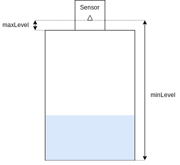

# Water Level Sensor
This project uses an ESP8266 on battery to measure the water level in a tank an reports it to a MQTT server over Wifi. It is meant to work on battery but can be used on USB power.

## Hardware
 * [Lilygo T-OI]() (it should work with other ESP8266-based boards but it ahs not been tested)
 * Ultra Sonic module AJ-SR04M (for example [here](https://www.aliexpress.com/item/33002362860.html?spm=a2g0o.order_list.0.0.75981802fHvoEg)).

 Optional:
  * A 16340 battery
  * Wifi antenna

The sensor should be placed in the tank where it will not pick up a reading from other obstacle so mind the [reading radius](https://github.com/tomaskovacik/kicad-library/blob/master/library/datasheet/K02-AJ-SR04/AJ-SR04M-T-X.zh-CN.en.pdf) 

## Preparation
In this application, the distance sensor is used in [Mode 4](https://www.mantech.co.za/Datasheets/Products/AJ-SR04M-200925A.pdf) (Low Power Serial Port Mode), so a 47 kΩ resistor must be soldered on R19.

Rename config.h.sample to config.h and adapt the settings to your environment.

Use [Arduino IDE](https://www.arduino.cc/en/software) to buil and deploy. Make sure you have the following libraries:
 * WiFi (by Arduino)
 * ArduinoJson (by Benoit Blanchon)
 * ArduinoLog (by Thijs Elenbaas)
 * PubSubClient (by Nick O’Leary)

 To deploy, set Flash mode to DOUT.

 ## Configuration
 The software is configured over MQTT. You need to send a JSON message to the device with configuration values. The possible settings are (case-sensitive):
  * minValue (Default 200mm): the value read when there is no water in the tank
  * maxValue (Default 10000mm): the value read when the tank is full
  * sleepTime (Default 300s): the time between 2 readings in seconds (max. 4260 because of [hardware limitations](https://thingpulse.com/max-deep-sleep-for-esp8266/)). This setting has a huge impact on autonomy.
  * maxDifference (Default 10%): the maximum difference allowed between 2 readings. If the difference is higher, another reading is performed.
  * logLevel (Default 3): a value [between 0 and 6](https://github.com/thijse/Arduino-Log) to define how much is logged.

Example:
  ```json
  {
    "minLevel": 400,
    "maxDifference": 15
  }
  ```
 Mind the quotes and casing!

 Make sure you send the config with the "retain" option. The values are read at the end of the reading cycle so it will take up to 5 minutes for the settings to apply. To speed up the process, you can push the reset button.

 